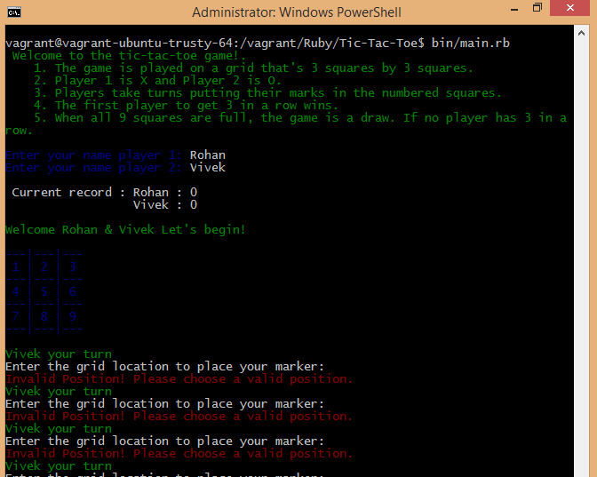

# Tic-Tac-Toe

This is an implementation of the game Tic Tac Toe.



# Technologies Used
- Ruby
- Rspec for testing

# Game Instructions
- The game is played on a grid that's 3 squares by 3 squares.
- Player 1 is X and Player 2 is O.
- Players take turns putting their marks in the numbered squares.
- The first player to get 3 in a row wins.
- 3 in a row implies the presence of 3 of the same marker ('X' or 'O') in consecutive positions.
- That is horizontally consecutive, vertically consecutive, or diagonally consecutive.
- When all 9 squares are full, the game is a draw, if no player has won.


# Usage
- If you want to play the game please clone the repo.
- Run ```ls -al``` and check the permissions for the repo
- If you do not have executable permissions please run ```chmod 777 <folder_name>```
- Run with ``` bin/main.rb```
- Have fun!

# Testing
- In the parent directory type ```$rspec``` to run the tests. 

# Live Version
- Please visit here and click on the run button: [Replit](https://repl.it/@rohansundar/tic-tac-toe)

# Contributors
- Rohan Sundar: [Github](https://www.github.com/rsundar)

